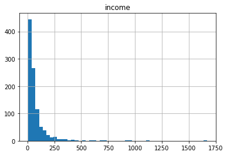
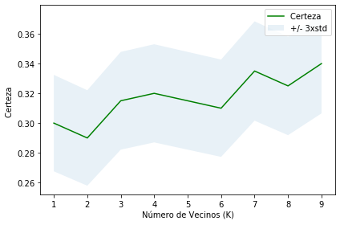

Prueba de algoritmo para aprendizaje supervisado **Vecinos K Más Cercanos**. Donde los datos se entrenana con puntos de datos que corresponden a su clasificación. Como un punto se predice, toma en cuenta los puntos 'K' más cercanos para determinar su clasificación


```python
import itertools
import numpy as np
import matplotlib.pyplot as plt
from matplotlib.ticker import NullFormatter
import pandas as pd
import matplotlib.ticker as ticker
from sklearn import preprocessing
%matplotlib inline
```

### Acerca del set de datos

Imagina un proveedor de telecomunicaciones que ha segmentado la base de sus clientes por servicio, categorizando a los clientes en cuatro grupos. Si los datos demográficos se pueden usar para predecir la pertenencia de grupo del envío, la compañía podría personalizar las ofertas para los prospectos. Es un problema de clasificación. O sea, dado un set de datos, con etiquetas predefinidas, necesitaremos construir un modelo para predecir la clase de un nuevo o desconocido caso. 

Este ejemplo hace foco en datos demográficos, sean region, edad, estado civil, para predecir patrones de uso. 

El campo objetivo (target), llamado __custcat__, tiene cuatro valores posibles que corresponden a los cuatro grupos de clientes, a saber:
  1- Servicio Básico
  2- E-Servicio
  3- Servicio Plus
  4- Servicio Total

El objetivo es construir un clasificador para predecir la clase de casos desconocidos. Utilizaremos un tipo específico de clasificación llamado K vecino más cercano.


```python
df = pd.read_csv('teleCust1000t.csv')
df.head()
```


<div>
<style scoped>
    .dataframe tbody tr th:only-of-type {
        vertical-align: middle;
    }

    .dataframe tbody tr th {
        vertical-align: top;
    }

    .dataframe thead th {
        text-align: right;
    }
</style>
<table border="1" class="dataframe">
  <thead>
    <tr style="text-align: right;">
      <th></th>
      <th>region</th>
      <th>tenure</th>
      <th>age</th>
      <th>marital</th>
      <th>address</th>
      <th>income</th>
      <th>ed</th>
      <th>employ</th>
      <th>retire</th>
      <th>gender</th>
      <th>reside</th>
      <th>custcat</th>
    </tr>
  </thead>
  <tbody>
    <tr>
      <th>0</th>
      <td>2</td>
      <td>13</td>
      <td>44</td>
      <td>1</td>
      <td>9</td>
      <td>64.0</td>
      <td>4</td>
      <td>5</td>
      <td>0.0</td>
      <td>0</td>
      <td>2</td>
      <td>1</td>
    </tr>
    <tr>
      <th>1</th>
      <td>3</td>
      <td>11</td>
      <td>33</td>
      <td>1</td>
      <td>7</td>
      <td>136.0</td>
      <td>5</td>
      <td>5</td>
      <td>0.0</td>
      <td>0</td>
      <td>6</td>
      <td>4</td>
    </tr>
    <tr>
      <th>2</th>
      <td>3</td>
      <td>68</td>
      <td>52</td>
      <td>1</td>
      <td>24</td>
      <td>116.0</td>
      <td>1</td>
      <td>29</td>
      <td>0.0</td>
      <td>1</td>
      <td>2</td>
      <td>3</td>
    </tr>
    <tr>
      <th>3</th>
      <td>2</td>
      <td>33</td>
      <td>33</td>
      <td>0</td>
      <td>12</td>
      <td>33.0</td>
      <td>2</td>
      <td>0</td>
      <td>0.0</td>
      <td>1</td>
      <td>1</td>
      <td>1</td>
    </tr>
    <tr>
      <th>4</th>
      <td>2</td>
      <td>23</td>
      <td>30</td>
      <td>1</td>
      <td>9</td>
      <td>30.0</td>
      <td>1</td>
      <td>2</td>
      <td>0.0</td>
      <td>0</td>
      <td>4</td>
      <td>3</td>
    </tr>
  </tbody>
</table>
</div>


# Visualización de Datos y Análisis 


```python
df['custcat'].value_counts()
```


    3    281
    1    266
    4    236
    2    217
    Name: custcat, dtype: int64


#### 281 Plus Service, 266 Basic-service, 236 Total Service, and 217 E-Service customers


```python
df.hist(column='income', bins=50)
```


    array([[<matplotlib.axes._subplots.AxesSubplot object at 0x7f243d5414d0>]],
          dtype=object)





```python
df.columns
```


    Index(['region', 'tenure', 'age', 'marital', 'address', 'income', 'ed',
           'employ', 'retire', 'gender', 'reside', 'custcat'],
          dtype='object')


```python
X = df[['region', 'tenure','age', 'marital', 'address', 'income', 'ed', 'employ','retire', 'gender', 'reside']] .values  #.astype(float)
X[0:5]

```


    array([[  2.,  13.,  44.,   1.,   9.,  64.,   4.,   5.,   0.,   0.,   2.],
           [  3.,  11.,  33.,   1.,   7., 136.,   5.,   5.,   0.,   0.,   6.],
           [  3.,  68.,  52.,   1.,  24., 116.,   1.,  29.,   0.,   1.,   2.],
           [  2.,  33.,  33.,   0.,  12.,  33.,   2.,   0.,   0.,   1.,   1.],
           [  2.,  23.,  30.,   1.,   9.,  30.,   1.,   2.,   0.,   0.,   4.]])


¿Cuáles son nuestras etiquetas?


```python
y = df['custcat'].values
y[0:5]
```


    array([1, 4, 3, 1, 3])


## Normalizar los Datos 


```python
X = preprocessing.StandardScaler().fit(X).transform(X.astype(float))
X[0:5]
```


    array([[-0.02696767, -1.055125  ,  0.18450456,  1.0100505 , -0.25303431,
            -0.12650641,  1.0877526 , -0.5941226 , -0.22207644, -1.03459817,
            -0.23065004],
           [ 1.19883553, -1.14880563, -0.69181243,  1.0100505 , -0.4514148 ,
             0.54644972,  1.9062271 , -0.5941226 , -0.22207644, -1.03459817,
             2.55666158],
           [ 1.19883553,  1.52109247,  0.82182601,  1.0100505 ,  1.23481934,
             0.35951747, -1.36767088,  1.78752803, -0.22207644,  0.96655883,
            -0.23065004],
           [-0.02696767, -0.11831864, -0.69181243, -0.9900495 ,  0.04453642,
            -0.41625141, -0.54919639, -1.09029981, -0.22207644,  0.96655883,
            -0.92747794],
           [-0.02696767, -0.58672182, -0.93080797,  1.0100505 , -0.25303431,
            -0.44429125, -1.36767088, -0.89182893, -0.22207644, -1.03459817,
             1.16300577]])


### Train Test Split  


```python
from sklearn.model_selection import train_test_split
X_train, X_test, y_train, y_test = train_test_split( X, y, test_size=0.2, random_state=4)
print ('Set de Entrenamiento:', X_train.shape,  y_train.shape)
print ('Set de Prueba:', X_test.shape,  y_test.shape)
```

    Set de Entrenamiento: (800, 11) (800,)
    Set de Prueba: (200, 11) (200,)


# Clasificación 


```python
from sklearn.neighbors import KNeighborsClassifier
```

### Entrenamiento


```python
k = 4
#Entrenar el Modelo y Predecir  
neigh = KNeighborsClassifier(n_neighbors = k).fit(X_train,y_train)
neigh
```


    KNeighborsClassifier(algorithm='auto', leaf_size=30, metric='minkowski',
                         metric_params=None, n_jobs=None, n_neighbors=4, p=2,
                         weights='uniform')


### Predicción


```python
yhat = neigh.predict(X_test)
yhat[0:5]
```


    array([1, 1, 3, 2, 4])


### Evaluación de certeza


```python
from sklearn import metrics
print("Entrenar el set de Certeza: ", metrics.accuracy_score(y_train, neigh.predict(X_train)))
print("Probar el set de Certeza: ", metrics.accuracy_score(y_test, yhat))
```

    Entrenar el set de Certeza:  0.5475
    Probar el set de Certeza:  0.32


```python
Ks = 10
mean_acc = np.zeros((Ks-1))
std_acc = np.zeros((Ks-1))
ConfustionMx = [];
for n in range(1,Ks):
    
    #Entrenar el Modelo y Predecir  
    neigh = KNeighborsClassifier(n_neighbors = n).fit(X_train,y_train)
    yhat=neigh.predict(X_test)
    mean_acc[n-1] = metrics.accuracy_score(y_test, yhat)

    
    std_acc[n-1]=np.std(yhat==y_test)/np.sqrt(yhat.shape[0])

mean_acc
```


    array([0.3  , 0.29 , 0.315, 0.32 , 0.315, 0.31 , 0.335, 0.325, 0.34 ])


#### Dibujo de la certeza del modelo para diferentes números de vecinos


```python
plt.plot(range(1,Ks),mean_acc,'g')
plt.fill_between(range(1,Ks),mean_acc - 1 * std_acc,mean_acc + 1 * std_acc, alpha=0.10)
plt.legend(('Certeza ', '+/- 3xstd'))
plt.ylabel('Certeza ')
plt.xlabel('Número de Vecinos (K)')
plt.tight_layout()
plt.show()
```





```python
print( "La mejor aproximación de certeza fue con ", mean_acc.max(), "con k=", mean_acc.argmax()+1) 
```

    La mejor aproximación de certeza fue con  0.34 con k= 9


```python

```
